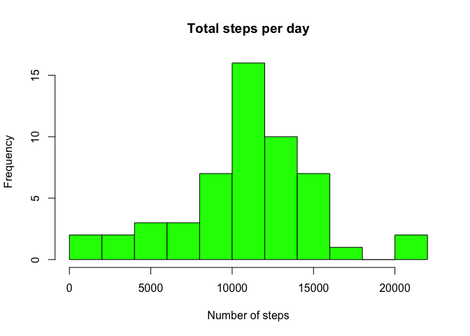
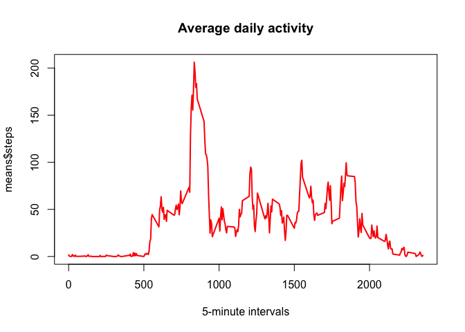
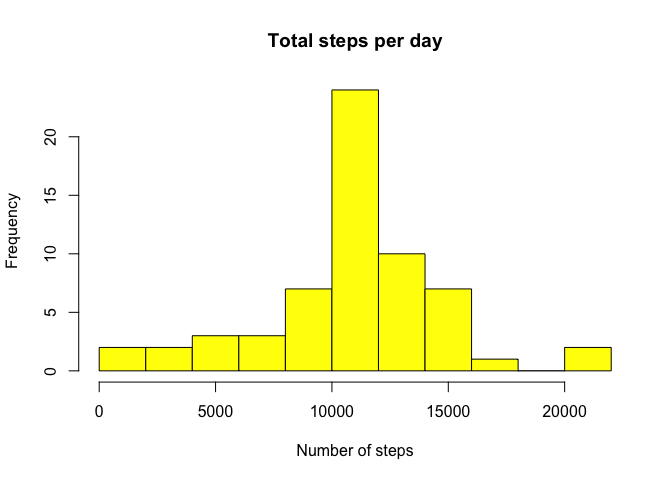
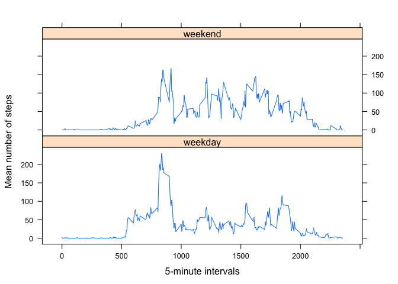

# Reproducible Research: Peer Assessment 1
This file will be rendered by knitr from R Markup into the HTML document. This document will answer all questions for the RepData_PeerAssessment1 task.

We will begin with unzipping the file containing source data. The original data (including NAs) will be stored in the data frame named "original".

```r
unzip("activity.zip")
original <- read.csv("activity.csv")
```

### Question 1: What is mean total number of steps taken per day?  
First of all, the total number of steps per day will be calculated. Then a histogram will be displayed, followed by the exact mean and median values.


```r
sums <- aggregate(steps ~ date, data = original, FUN = "sum", na.rm=T)
hist(sums$steps, n = 15, col = "green", main = "Total steps per day", xlab="Number of steps")
```

 

```r
mean(sums$steps)
```

```
## [1] 10766.19
```

```r
median(sums$steps)
```

```
## [1] 10765
```

### Question 2: What is the average daily activity pattern?
To answer this question, the "aggregate" function will be used to determine the average number of steps per interval (mean over all days). Afterwards, the results will be plotted on the line chart.  


```r
means <- aggregate(steps ~ interval, data = original, FUN = "mean", na.rm=T)
plot(means$interval, means$steps, type="l", lwd=2, col = "red", main = "Average daily activity", xlab="5-minute intervals")
```

 

```r
max_avg_activity <- means[means$steps == max(means$steps),1]
```

***Answer***: The 5-minute interval with the highest average daily activity is ***835***.

### Question 3: What about the missing values?
The number of missing values in the source data will be calculated below. After that, a new dataset will be created - fixing the missing values by substituting them with the overall mean value for that interval. 


```r
sum(is.na(original$steps))
```

```
## [1] 2304
```

```r
missing_fixed <- original
missing_fixed[is.na(missing_fixed),"steps"] <- means$steps
```

Finally, the histogram and the mean/median values from Question 1 will be re-plotted.  


```r
sum_mf <- aggregate(steps ~ date, data = missing_fixed, FUN = "sum")
hist(sum_mf$steps, n = 15, col = "yellow", main = "Total steps per day", xlab="Number of steps")
```

 

```r
mean(sum_mf$steps)
```

```
## [1] 10766.19
```

```r
median(sum_mf$steps)
```

```
## [1] 10766.19
```

The mean and median values stay almost the same (before and after substituting the missing values with the overall averages). Regarding the total number of steps before and after substituting the missing values:


```r
summary(sums)
```

```
##          date        steps      
##  2012-10-02: 1   Min.   :   41  
##  2012-10-03: 1   1st Qu.: 8841  
##  2012-10-04: 1   Median :10765  
##  2012-10-05: 1   Mean   :10766  
##  2012-10-06: 1   3rd Qu.:13294  
##  2012-10-07: 1   Max.   :21194  
##  (Other)   :47
```

```r
summary(sum_mf)
```

```
##          date        steps      
##  2012-10-01: 1   Min.   :   41  
##  2012-10-02: 1   1st Qu.: 9819  
##  2012-10-03: 1   Median :10766  
##  2012-10-04: 1   Mean   :10766  
##  2012-10-05: 1   3rd Qu.:12811  
##  2012-10-06: 1   Max.   :21194  
##  (Other)   :55
```

```r
diff <- round((sum(sum_mf$steps) - sum(sums$steps)),digits=0)
diff
```

```
## [1] 86130
```

***Answer:*** The replacement of NA values with the overall averages has added ***8.613\times 10^{4}*** "missing" steps to the new data set. The most differences can be seen on the 1st and 3rd quantiles (25% and 75% of the values, accordingly)

### Question 4: Are there differences in activity patterns between weekdays and weekends?  
Generate the factors with 2 levels: "weekday", "weekend":

```r
missing_fixed$type <- ifelse(weekdays(as.Date(missing_fixed$date)) %in% c("Saturday", "Sunday"), "weekend", "weekday")
missing_fixed$type <- as.factor(missing_fixed$type)
```

Aggregate the data by interval and by week type, and generate the plot in lattice (documenting the difference between weekday and weekend activity levels):

```r
mean_ww <- aggregate(steps ~ interval * type, data = missing_fixed, FUN="mean")
library(lattice)
xyplot(steps ~ interval | type, data = mean_ww, layout=c(1,2), type="l", ylab="Mean number of steps", xlab = "5-minute intervals")
```

 
